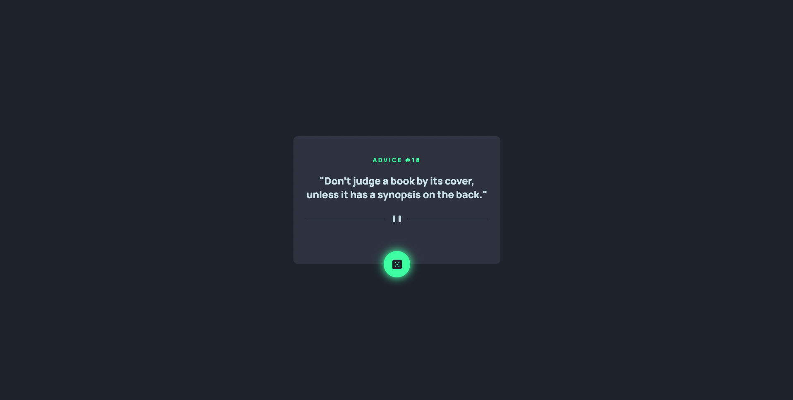

# Frontend Mentor - Advice generator app

## The challenge

The challenge was to build out this advice generator app using the [Advice Slip API](https://api.adviceslip.com) and get it looking as close to the design as possible.

Users should be able to:

- View the optimal layout for the app depending on their device's screen size
- See hover states for all interactive elements on the page
- Generate a new piece of advice by clicking the dice icon

## Building The Project

This is my 12th Frontend Mentor challenge, been away doing and learning some other stuff and decided to use this project to practice some of the things I've leant in recent times.

For this project I used:

- [`REACTJS`](https://reactjs.org) as the JavaScript Frontend Library of choice so I could practice and solidify my knowledge of some important React Hooks like `useState` and `useEffect`
- I used the `fetchAPI` to pull neccessary data from the [Advice Slip API](https://api.adviceslip.com)
- Also, I used `Custom CSS` as opposed to using a styling library, just to make sure I've not lost touch. Although, I'll mostly use `Chakra-UI` in most of the projects I'll be working on next, this was a good way for me to still practice my Vanilla CSS skills.

## Deploying The project

The project was deployed on: [GitHub Pages](https://pages.github.com/), and here is the [Live Link](https://emmanueloloke.github.io/advice-generator-app/).

## Sharing The solution

- [Live Link](https://emmanueloloke.github.io/advice-generator-app/)
- [Frontend Mentor Solution Link](https://www.frontendmentor.io/solutions/advice-generator-app-lUT6COkhDr)
- [Tweeted About it Here](https://twitter.com/I_am_Pope/status/1548852603781632002?s=20&t=ZeYfqPVTwG3XE8gulLlgpw)
